# Context Switching API

Complete technical reference for the context-aware development environment system.

---

## Overview

The context switching system provides automatic environment configuration switching between work and personal development contexts. When you switch contexts, the system automatically configures:

- Git user email
- SSH keys
- Default browser
- GitHub CLI authentication
- Database connection parameters
- Project and config directories
- Environment variables

---

## Architecture

### File Structure

```
config/zsh/
├── zshrc                         # Main config (sources all modules)
├── config/
│   ├── aliases.zsh              # Command aliases
│   ├── functions.zsh            # Context switching functions
│   ├── paths.zsh                # PATH configuration
│   └── custom.zsh               # User customizations
├── contexts/
│   ├── current.zsh              # Generated context file (gitignored)
│   └── current.zsh.template     # Template for generation
└── private/
    ├── api-keys.zsh             # Context configuration (gitignored)
    └── api-keys.zsh.template    # Template for configuration
```

### Deployed Locations

```
~/.zshrc                          # Symlink to config/zsh/zshrc
~/.config/zsh/                    # Deployed configuration
├── config/                       # Copied from config/zsh/config/
├── contexts/
│   └── current.zsh              # Runtime-generated context
└── private/
    └── api-keys.zsh             # User configuration (not in repo)
```

---

## Configuration

### Setting Up Contexts

1. **Copy template:**
   ```bash
   cp config/zsh/private/api-keys.zsh.template config/zsh/private/api-keys.zsh
   ```

2. **Edit configuration:**
   ```bash
   vi config/zsh/private/api-keys.zsh
   ```

3. **Deploy to home directory:**
   ```bash
   ./setup-helpers/03-setup-shell.sh
   ```

### Configuration Variables

#### Work Context

| Variable | Purpose | Example |
|----------|---------|---------|
| `WORK_CONTEXT_NAME` | Display name | `"Acme Corp"` |
| `WORK_ORG` | Organization ID | `"ACME_CORP"` |
| `WORK_GIT_EMAIL` | Git commit email | `"user@company.com"` |
| `WORK_BROWSER` | Browser shorthand | `"browser"`, `"chrome"`, `"safari"` |
| `WORK_GITHUB_HOST` | GitHub hostname | `"github.company.com"` |
| `WORK_GH_USER` | Expected GH username | `"workuser"` |
| `WORK_DB_HOST` | Database host | `"localhost"` |
| `WORK_DB_PORT` | Database port | `"5433"` |
| `WORK_DB_NAME` | Database name | `"work_dev"` |
| `WORK_DB_USER` | Database user | `"work_user"` |

#### Personal Context

| Variable | Purpose | Example |
|----------|---------|---------|
| `PERSONAL_CONTEXT_NAME` | Display name | `"Personal"` |
| `PERSONAL_ORG` | Organization ID | `"PERSONAL"` |
| `PERSONAL_GIT_EMAIL` | Git commit email | `"user@email.com"` |
| `PERSONAL_BROWSER` | Browser shorthand | `"beta"`, `"firefox"` |
| `PERSONAL_GITHUB_HOST` | GitHub hostname | `"github.com"` |
| `PERSONAL_GH_USER` | Expected GH username | `"personaluser"` |
| `PERSONAL_DB_HOST` | Database host | `"localhost"` |
| `PERSONAL_DB_PORT` | Database port | `"5432"` |
| `PERSONAL_DB_NAME` | Database name | `"personal_dev"` |
| `PERSONAL_DB_USER` | Database user | `"personal_user"` |

---

## Context Switching Flow

### `work()` Function Flow

```mermaid
graph TD
    A[Call work] --> B[Set environment variables]
    B --> C[Update Git config]
    C --> D{Git update successful?}
    D -->|Yes| E[✅ Git email set]
    D -->|No| F[⚠️ Git config failed]
    E --> G[Manage SSH keys]
    F --> G
    G --> H{Personal key exists?}
    H -->|Yes| I[Load id_ed25519]
    H -->|No| J[⚠️ Key not found]
    I --> K{Work key exists?}
    J --> K
    K -->|Yes| L[Load id_ed25519_work]
    K -->|No| M[⚠️ Key not found]
    L --> N{defaultbrowser available?}
    M --> N
    N -->|Yes| O[Switch to work browser]
    N -->|No| P[Skip browser switch]
    O --> Q{Browser already correct?}
    Q -->|Yes| R[✅ Skip switch]
    Q -->|No| S[Execute defaultbrowser]
    S --> T[Wait for user confirmation]
    T --> U[Poll for settings update]
    U --> V{GitHub Enterprise?}
    R --> V
    P --> V
    V -->|Yes| W{Can reach GH Enterprise?}
    V -->|No| Z
    W -->|Yes| Z[✅ VPN connected]
    W -->|No| X[⚠️ Prompt for VPN]
    X --> Y[Wait for VPN connection]
    Y --> Z
    Z --> AA{gh CLI available?}
    AA -->|Yes| AB[Check GH auth]
    AA -->|No| AC[Skip GH check]
    AB --> AD{Authenticated?}
    AD -->|Yes| AE[✅ Show username]
    AD -->|No| AF[⚠️ Not authenticated]
    AE --> AG[Write context file]
    AF --> AG
    AC --> AG
    AG --> AH{Write successful?}
    AH -->|Yes| AI[cd to PROJECT_ROOT]
    AH -->|No| AJ[❌ Context switch failed]
    AI --> AK[✅ Context switch complete]
```



### `personal()` Function Flow

Similar to `work()` with these differences:

1. **SSH Key Management:**
   - **Unloads** work key (`id_ed25519_work`)
   - Loads personal key (`id_ed25519`)

2. **No VPN Check:**
   - GitHub.com assumed reachable
   - No VPN connectivity prompts

3. **Browser:**
   - Switches to personal browser

4. **Environment:**
   - Sets personal database config
   - Uses personal GitHub username

---

## Runtime Context File

### Location

`~/.config/zsh/contexts/current.zsh`

### Generated Content

```bash
#!/bin/zsh
# Current development context (auto-generated by work() function)
export WORK_CONTEXT="ACME_CORP"
export PROJECT_ROOT="/Users/username/work/projects/work"
export CONFIG_ROOT="/Users/username/work/configs/work"
export DB_HOST="localhost"
export DB_PORT="5433"
export DB_NAME="work_dev"
export DB_USER="work_user"
```

### Generation Process

1. **Atomic Write:**
   ```bash
   temp_file="${context_file}.tmp.$$"
   cat > "$temp_file" <<EOF
   # ... content ...
   EOF
   ```

2. **Validation:**
   ```bash
   if [[ -s "$temp_file" ]] && grep -q "WORK_CONTEXT" "$temp_file"; then
       chmod 600 "$temp_file"
       mv -f "$temp_file" "$context_file"
   fi
   ```

3. **Permissions:**
   - `600` (read/write for owner only)

4. **Loading:**
   - Sourced in `.zshrc` after all config modules
   - Creates environment variables in current shell

---

## Browser Switching

### Supported Browsers

| Shorthand | Bundle ID | Browser |
|-----------|-----------|---------|
| `browser` | `com.brave.browser` | Brave Browser |
| `beta` | `com.brave.browser.beta` | Brave Beta |
| `chrome` | `com.google.chrome` | Google Chrome |
| `safari` | `com.apple.safari` | Safari |
| `firefox` | `org.mozilla.firefox` | Firefox |

### Browser Detection

Uses Python3 to read LaunchServices plist:

```python
plist_path = os.path.expanduser(
    '~/Library/Preferences/com.apple.LaunchServices/com.apple.launchservices.secure.plist'
)
with open(plist_path, 'rb') as f:
    plist = plistlib.load(f)

handlers = plist.get('LSHandlers', [])
http_handler = next(
    (h for h in handlers if h.get('LSHandlerURLScheme') == 'http'),
    {}
)
bundle_id = http_handler.get('LSHandlerRoleAll', '')
```

### Browser Switch Flow

1. Get current browser bundle ID
2. Compare with expected bundle ID
3. If different:
   - Execute `defaultbrowser <shorthand>`
   - Wait for user to confirm system dialog
   - Poll for plist update (max 10s)
   - Verify browser changed

4. If same:
   - Skip switch
   - Show "already set" message

### User Interaction

```
🌐 Switching default browser...
💡 A system alert should appear asking to confirm the browser change
Press Enter after confirming (or canceling) the browser change...
⏳ Waiting for system to update browser settings...
✅ Browser settings updated
```

---

## SSH Key Management

### Key Files

| Context | Key File | Description |
|---------|----------|-------------|
| Both | `~/.ssh/id_ed25519` | Personal SSH key (always loaded) |
| Work | `~/.ssh/id_ed25519_work` | Work SSH key (loaded in work context) |

### Loading Strategy

**Work Context:**
1. Load personal key (if not already loaded)
2. Load work key (if not already loaded)
3. Both keys available for git operations

**Personal Context:**
1. Unload work key (if loaded)
2. Load personal key (if not already loaded)
3. Only personal key available

### Detection

```bash
# Check if key is loaded
ssh-add -l | grep -q "id_ed25519"

# Load key
ssh-add "$HOME/.ssh/id_ed25519"

# Unload key
ssh-add -d "$HOME/.ssh/id_ed25519_work"
```

---

## GitHub CLI Integration

### Authentication Check

```bash
gh auth status --hostname "$gh_host" 2>&1
```

### Username Verification

```bash
gh api user --hostname "$gh_host" -q .login
```

### Expected Behavior

**Work Context:**
- Checks authentication to `$WORK_GITHUB_HOST`
- Verifies username matches `$WORK_GH_USER`
- Requires VPN for GitHub Enterprise

**Personal Context:**
- Checks authentication to `$PERSONAL_GITHUB_HOST` (usually github.com)
- Verifies username matches `$PERSONAL_GH_USER`
- No VPN required

### Error States

| State | Message | Action |
|-------|---------|--------|
| Not authenticated | ⚠️ Not authenticated to github.com | Run: `gh auth login --hostname github.com` |
| Wrong username | ⚠️ Logged in as: user (expected: expected_user) | Login with correct account |
| Cannot reach host | ⚠️ Cannot reach github.company.com | Connect to VPN |

---

## VPN Connectivity

### When Required

- Work context with GitHub Enterprise
- `WORK_GITHUB_HOST` != "github.com"

### Connectivity Check

```bash
curl -s -o /dev/null --max-time 3 "https://$gh_host/api/v3"
```

### Flow

1. **Check connectivity:**
   - Attempt to reach GitHub API endpoint
   - 3 second timeout

2. **If unreachable:**
   - Show warning
   - Prompt to connect VPN
   - Wait for user confirmation (5 minute timeout)
   - Re-check connectivity

3. **If still unreachable:**
   - Skip GitHub CLI checks
   - Continue with context switch

### User Interaction

```
🔍 Checking connectivity to github.company.com...
⚠️  Cannot reach github.company.com
💡 Please connect to GlobalProtect VPN
Press Enter after connecting to VPN (or Ctrl+C to skip)...

✅ Connected to github.company.com
```

---

## Error Handling

### Git Configuration Errors

```bash
if git config --global user.email "$work_email" 2>/dev/null; then
    echo "✅ Git email: $work_email"
else
    echo "❌ Failed to set Git email"
    echo "💡 Check if git is installed and configured"
fi
```

### SSH Key Errors

```bash
if ssh-add "$HOME/.ssh/id_ed25519" 2>/dev/null; then
    echo "✅ Personal SSH key loaded"
else
    echo "❌ Failed to load personal SSH key"
    echo "💡 Try: ssh-add $HOME/.ssh/id_ed25519"
fi
```

### Context File Write Errors

```bash
if [[ -s "$temp_file" ]] && grep -q "WORK_CONTEXT" "$temp_file"; then
    mv -f "$temp_file" "$context_file"
else
    echo "❌ Failed to create context file"
    rm -f "$temp_file"
    return 1
fi
```

---

## Environment Variables

### Set by Context Functions

| Variable | Work Value | Personal Value | Usage |
|----------|------------|----------------|-------|
| `WORK_CONTEXT` | `$WORK_ORG` | `$PERSONAL_ORG` | Identify current context |
| `PROJECT_ROOT` | `~/work/projects/work` | `~/work/projects/personal` | Project directory |
| `CONFIG_ROOT` | `~/work/configs/work` | `~/work/configs/personal` | Config directory |
| `DB_HOST` | `$WORK_DB_HOST` | `$PERSONAL_DB_HOST` | Database host |
| `DB_PORT` | `$WORK_DB_PORT` | `$PERSONAL_DB_PORT` | Database port |
| `DB_NAME` | `$WORK_DB_NAME` | `$PERSONAL_DB_NAME` | Database name |
| `DB_USER` | `$WORK_DB_USER` | `$PERSONAL_DB_USER` | Database user |

### Persisted in current.zsh

All variables above are written to `~/.config/zsh/contexts/current.zsh` and automatically loaded on shell start.

---

## Database Integration

### Context-Aware Databases

The system supports running different databases per context:

**Work Context:**
```bash
DB_HOST=localhost
DB_PORT=5433
DB_NAME=work_dev
DB_USER=work_user
```

**Personal Context:**
```bash
DB_HOST=localhost
DB_PORT=5432
DB_NAME=personal_dev
DB_USER=personal_user
```

### Usage

Scripts and applications can read these variables:

```bash
# Connect to context-specific database
psql -h "$DB_HOST" -p "$DB_PORT" -U "$DB_USER" -d "$DB_NAME"

# Or in Python
import os
DB_URL = f"postgresql://{os.environ['DB_USER']}@{os.environ['DB_HOST']}:{os.environ['DB_PORT']}/{os.environ['DB_NAME']}"
```

---

## Best Practices

### Configuration

1. **Never commit `api-keys.zsh`:**
   - Contains personal email addresses
   - Contains organizational info
   - Keep gitignored

2. **Use templates:**
   - Modify `api-keys.zsh.template` for new variables
   - Commit template changes
   - Users copy and customize

3. **Test both contexts:**
   - Switch to work
   - Verify git email
   - Verify SSH keys
   - Verify browser
   - Switch to personal
   - Verify all settings again

### Usage

1. **Switch before work:**
   ```bash
   work
   # Now in work context
   cd myproject
   git commit -m "Work commit"  # Uses work email
   ```

2. **Switch for personal:**
   ```bash
   personal
   # Now in personal context
   cd my-oss-project
   git commit -m "Personal commit"  # Uses personal email
   ```

3. **Check current context:**
   ```bash
   show-context
   # Displays all current settings
   ```

### Troubleshooting

**Browser won't switch:**
- Confirm system dialog appeared
- Press Enter after confirming
- Check `defaultbrowser` is installed

**SSH key not loading:**
- Check key file exists
- Verify permissions (600 for private key)
- Try manual load: `ssh-add ~/.ssh/id_ed25519`

**GitHub not authenticated:**
- Run: `gh auth login --hostname github.com`
- Follow authentication flow
- For work: Ensure VPN connected

**Git email not changing:**
- Check git is installed
- Verify config not set per-repo
- Check `git config --global user.email`

---

## API Reference

### Functions

| Function | Purpose |
|----------|---------|
| `work()` | Switch to work context |
| `personal()` | Switch to personal context |
| `show-context()` | Display current context |
| `_get_default_browser()` | Get current browser (internal) |

### Files

| File | Purpose | Gitignored |
|------|---------|------------|
| `config/zsh/private/api-keys.zsh` | User configuration | Yes |
| `config/zsh/contexts/current.zsh` | Runtime context (deployed) | Yes |
| `~/.config/zsh/private/api-keys.zsh` | Deployed configuration | N/A |
| `~/.config/zsh/contexts/current.zsh` | Active context | N/A |

### Exit Codes

| Code | Meaning |
|------|---------|
| 0 | Success |
| 1 | Context file creation failed |

---

## See Also

- [Shell Functions API](shell-functions.md) - Complete function reference
- [Script Conventions](script-conventions.md) - Coding standards
- `config/zsh/config/functions.zsh` - Source code
- `config/zsh/private/api-keys.zsh.template` - Configuration template
